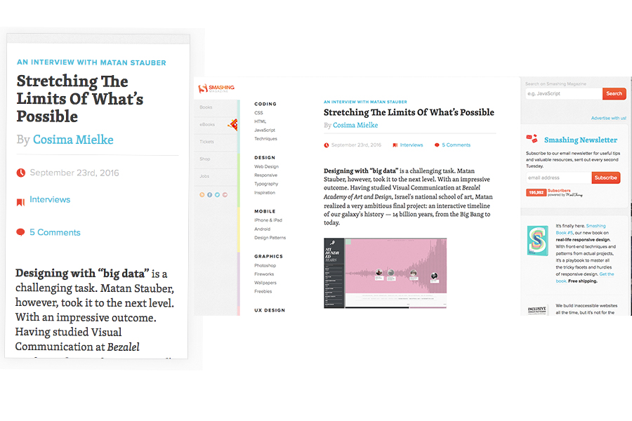

#Responsive website experimentation

Below is an example of the smashing magazine website 

Below is an example of [Smashing magazines website](https://www.smashingmagazine.com/), the website responds in the following way 

- When we transition to smaller displays the both side panels are hidden. 
- The horizontal menu transitions to a drop down list on smaller devices 

